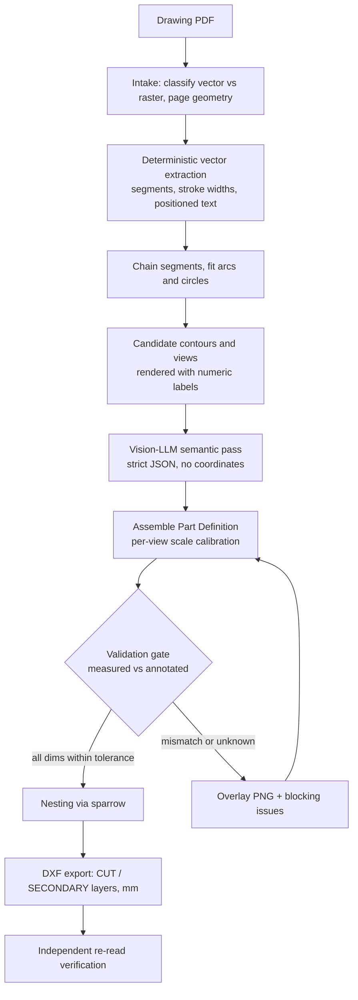

# Drawing-to-CNC pipeline prototype

## Objective

Answer one question with evidence: **can a drawing PDF become a trustworthy cut-ready DXF with only exception-based human review?** Deliverable is a local CLI plus inspectable artifacts, not a SaaS. No web app, no auth, no database, no queue.

## The central design decision

Your sample is a **native vector PDF**. I verified it contains 2,851 stroked line segments and zero curve operators, all text extractable with coordinates. That changes the division of labour from your original sketch:

- **The geometry is already in the file.** It does not need to be reconstructed from dimension text by a constraint solver.
- **The LLM never emits coordinates.** It answers semantic multiple-choice questions: which chains are the part outline, which view is which, which dimension text belongs to which feature, what does the title block say.
- **The validation gate compares two independent sources**: geometry measured from PDF paths versus dimension values read as text. Agreement is real evidence, not self-consistency. This is what makes the gate meaningful rather than decorative.

A constraint solver stays out of scope for vector inputs. It only becomes necessary for scanned raster drawings, which you said are the minority.

## Verified facts driving the design

- Chaining the 2,851 disconnected micro-segments by endpoint proximity collapsed them to 722 polylines; several circle-fit with under 0.1 unit deviation, so the annotated arcs (R3020, R3091, R3092, R3155, R3190) are recoverable by fitting.
- Exactly 5 discrete stroke widths (5.98 on 1,787 segments, 11.96 on 918, 1.794 on 121, 16.744 on 23, 32.89 on 2). Thick equals part outline, thin equals dimension and centre lines. A free deterministic prior before any AI.
- The page mixes scales: main view 1:2.5, section A-A 1:1. Scale calibration must be **per view**, not per document.
- German decimal commas (`552,1`) and a bilingual DE/EN title block.
- My hand-rolled content-stream parser mishandled the transform stack, which is exactly why the real implementation uses a library rather than bespoke parsing.

## Dependency choices

- **Python 3.12 via `uv`.** System Python is 3.9.6 and every library needed requires >= 3.10.
- **`pdfplumber` (MIT) for vector extraction**, `pypdfium2` (BSD/Apache) for rasterising overlays. **Deliberately not PyMuPDF**: it is AGPL-3.0, which is a licensing landmine for a commercial SaaS. Choosing this now avoids a painful rewrite later.
- **`spyrrow` (Python wheel wrapping `sparrow`) for nesting.** A prebuilt `macosx_11_0_arm64` wheel for cp312 exists, so you get the real state-of-the-art engine built on jagua-rs with no Rust toolchain. Rust is only needed if we later want the `lbf` bin-packing CLI.
- `ezdxf` (MIT) for DXF, `shapely` (BSD) for polygon validation.

## Pipeline



## Repo layout

```
pyproject.toml            # uv-managed, py3.12
src/sheetcopilot/
  cli.py                  # run + per-stage subcommands, resumable
  intake.py               # vector vs raster classification, page metadata
  vector.py               # pdfplumber extraction: segments, widths, text+bbox
  chains.py               # endpoint chaining, arc/circle fitting
  views.py                # view clustering, per-view scale calibration
  llm/
    provider.py           # swappable Anthropic / OpenAI / Gemini adapter
    schemas.py            # pydantic strict output contracts
    prompts.py
  reconstruct.py          # Part Definition assembly
  validate.py             # measured-vs-annotated gate, blocking issues
  overlay.py              # reconstruction over original render
  nest.py                 # spyrrow adapter behind NestingEngine interface
  dxf.py                  # ezdxf export + re-read verification
  report.py               # single HTML page to eyeball a run
runs/<slug>/              # numbered JSON artifacts per stage + overlay.png + dxf/
```

Every stage reads the previous stage's JSON and writes its own. That means a stage can be re-run in isolation, and when output is wrong you can see exactly which stage broke it.

## Milestones

### M1 is the go/no-go gate

M1 either proves or kills the vector-first thesis, so it comes before any LLM work. If measured geometry cannot reproduce the annotated numbers, the whole approach changes and no amount of prompt engineering saves it.

**Acceptance for M1:** fitted radii reproduce R3020, R3091, R3092, R3155 and R3190 within 0.5 mm, and measured linear extents reproduce 552,1 / 583,3 / 522,4 / 185 within 0.5 mm, with the scale derived rather than hardcoded.

Scale calibration uses consensus voting: for each annotated linear value and each plausible measured distance, the ratio votes for a scale; the true scale wins by vote count, with the title block's `1:2.5` as a prior. The same machinery yields the validation evidence, so it is built once and used twice.

### Golden acceptance for the sample drawing

The concrete target that proves the pipeline end to end:

- Title block: part no `413-13-600`, material `S235J2G3`, thickness `25`, scale `1:2.5`, units mm.
- Primary curved wear-plate profile identified; section A-A, title block and reference geometry all excluded.
- Three holes: **cut ø18 through, and record ø34 at 45 degrees as a countersink secondary operation that is not cut.** Getting this wrong means scrapping parts, so it is an explicit test, not a footnote.
- DXF reopens in `ezdxf` with closed polylines, mm units, and separate `CUT` and `SECONDARY_OP` layers.

## Known decision points, flagged not hidden

- **`sparrow` solves strip packing, not fixed-sheet bin packing.** Real workshops have fixed sheets (2500x1250). M4 includes a short spike on two options: strip-pack at sheet width then slice, versus iterative single-sheet filling. The `NestingEngine` interface keeps this swappable, and jagua-rs `min_item_separation` maps directly onto kerf plus clearance.
- **Contour selection is the accuracy crux.** Approach: deterministic candidate generation, render candidates with numeric labels, let the LLM pick by number. Choosing among rendered candidates is far more reliable than asking a model to emit geometry.
- **One drawing is not a corpus.** The highest-value non-code action is collecting 5 to 10 more real customer PDFs from different suppliers. Tuning against a single file will overfit, and generalisation is the actual product risk.
